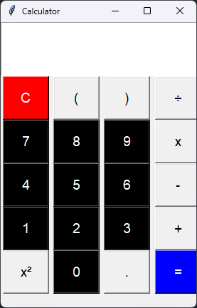

## Calculator 🧮

This is a simple calculator made using tkinter in python. It can perform basic arithmetic operations such as addition, subtraction, multiplication, and division. It can also evaluate simple expressions and calculate the square of a number.

Here is an example screenshot below: 




## Features

* Perform basic arithmetic operations
* Evaluate simple expressions
* Calculate the square of a number

## Instructions

1. Enter a number or expression into the text field.
2. Click on the appropriate operator button.
3. Repeat steps 1 and 2 until you are finished with your calculation.
4. Click on the "=" button to evaluate the expression.

## Example

5 + 2 * 3 = 17

## Requirements

* Python 3.6+
* tkinter

## Usage

To run the calculator, simply type the following command in a terminal:

```python calculator.py```

## Contributing

If you have any suggestions for improvement or would like to contribute to the project, please feel free to open a pull request.

## License

This project is licensed under the MIT License.